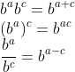

## 数学函数
算法分析中最常用的有七种函数，本文将分别介绍其概念以及定理，并附带部分练习题用以加深理解。
___
### 常数函数
  
最简单的就是常数函数了！n是什么并不重要，f(n)的结果总是c。
___
### 对数函数
  
算法分析中，对数函数可以说是无处不在，十分常用。  
我们都知道在计算机科学中，是采用二进制存储数据的，并且很多算法的常见操作都是做二分处理，所以在算法分析中底数b=2是最常见的，因此我们
经常省略底数b，即：  
  
在数学中，省略底数b的时候，底数b为10。
#### 对数函数定理：  
  
这些很重要，需要记住，感兴趣的可以自行证明。  

例题：  

___  
### 线性函数
  
线性函数也是很简单的，不多做介绍了。
___
### n log n函数
  
这是一种特殊的对数函数，增长速度比线性函数快，比二次函数慢。  
___
### 二次函数
  
二次函数也比较常见，一般出现在循环的算法中。 

二次函数有一个常见且重要的定理：  
 
___
### 三次函数
  
三次函数在算法分析中出现的频率已经很低了，但还是会时不时的出现。
___
### 指数函数
  
指数函数就比较少见了，当算法的复杂度是指数函数的时候，就说明算法可能和我们的预期相差很远了。但是了解指数函数，对于算法分析是很有帮助的。

指数函数定理：  
  
相对于指数函数的定理来说，对于这部分的印象还是比较深的。 
