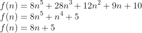
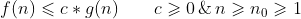

## 算法复杂度（函数）表示
到目前为止，我们可以用数学函数来表示一个算法的复杂度了：  
  
图中给出了三个函数，两个比较复杂一个比较简单。那么问题来了：  
对比图中1、2两个函数，怎么比较两个函数的增长率（算法优劣）？很难一眼就看出来吧！  
你可能会说忽略常数项、忽略系数、忽略低阶项就可以看出来了！确实是这样的，但是为什么呢？大O表示法又是怎么来的呢？
下边看看大佬是怎么处理的。

## 用函数表示函数（渐进分析）
我们关注的重点是函数的增长率，因此可以用一个简单函数去表示复杂函数，只要这两个函数的增长情况表示一致就可以。  

这个简单函数怎么来的呢？是通过离散数学中的渐进分析得来的，大O的定义为：  
大O符号（Big O notation）是用于描述函数渐进行为的数学符号。更确切地说，它是用另一个（通常更简单的）函数来描述一个函数数量级的渐近上界。
在数学中，它一般用来刻画被截断的无穷级数尤其是渐近级数的剩余项；在计算机科学中，它在分析算法复杂性的方面非常有用。
[百度百科大O符号](https://baike.baidu.com/item/%E5%A4%A7O%E7%AC%A6%E5%8F%B7 "大O符号")
  
从定义中我们可以了解到，大O符号允许我们以简单函数去描述复杂函数，有渐进的意思。

## 大O表示法
复杂函数表示为f(n)，简单函数表示为g(n)，如果二者满足：  
  
那么，我们就说f(n)是O(g(n))
  
例：证明2n+1是O(n)  
证明：根据大O的定义，我们需要找到一个常数c和一个n值，使得2n+1 ≤ c*n。我们很容易找到 c=10, n=1，所以2n+1就是O(n)。  

这里大家肯定发现了，c=10,n=1只是无限个解中的一个。但是我们上面已经提到，大O表示法，就是用一个简单函数表示一个复杂函数，其关注的重点是函数的
增长率。而这无限个解都只是常数而已，不会影响函数的增长表现。所以，只要满足了定义，就可以用大O表示。

在数学中，cg(n)是f(n)的渐进上界。
我们知道O有渐进的意思，那么通俗的讲就是：f(n)函数在满足条件的情况下，表现趋近于函数g(n)。

我们通常说f(n)是O(g(n))，而不是f(n) = O(g(n))。因为O本身就是渐进的意思，而不是代表g(n)的某种运算使其相等。

下面我们需要做的就是找到一个方法，能快速的得到简单函数g(n)。
## 忽略常量因子和低阶项（大O表示法的性质）
很多人都知道在算法中，可以忽略常量因子和低阶项，从而得到算法的复杂度，但这是为什么呢？  
搞个例子看一下：  
例题：证明5n^4 + 4n^3 +3n^2 + 2n + 1是O(n^4)
证明：5n^4 + 4n^3 +3n^2 + 2n + 1 ≤ (5+4+3+2+1)n^4，根据大O表示法的定义，常量因子c = 15, n≥1。所以，g(n) = n^4，
也就是说5n^4 + 4n^3 +3n^2 + 2n + 1是O(n^4)  

相信大家也发现了，对于这个例题来说O(n^5)也满足条件，也可以说复杂度是O(n^5)。是这样的，没有问题！但是我们在描述一个函数的时候，不仅仅是要用
简单的函数去描述复杂函数，同时g(n)更应该尽可能的接近原函数，更贴近原函数的表现真相。因此，对于上述例题我们会说复杂度是O(n^4)。

上面的例题延伸一下：  
证明 a + b*n + c*n^2 + ... + x*n^d是O(n^d)  
相同的证明方法： a + b*n + c*n^2 + ... + x*n^d ≤ (|a| + |b| + |c| + .. + |x|)*n^d，常量因子为系数的绝对值的和,n > 1，
满足大O表示法的定义，所以复杂度是O(n^d)。

从延伸例题得到的结果我们就可以看出，当去处理复杂函数的复杂度时，可以忽略常量因子和低阶项。

# NEXT
[算法的比较分析](../d_算法比较分析)