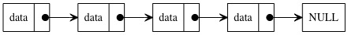

## 单向链表
单向链表就是由多个节点组成的线性数据结构，每个节点存储指向下一个节点的地址，如图所示：  

其中有两个节点比较特殊，第一个节点叫做头节点，最后一个节点叫尾节点。头节点存有链表的开始地址，通过头节点可以遍历
整个链表。尾结点的next指针并不是指向下一个节点，而是指向NULL，表示链表的结束。

## 链表访问
对比数组访问元素O(1)时间复杂度，链表的访问复杂度为O(n)，不能直接访问某个节点。需要从头节点遍历找到目标节点，
因此时间复杂度为O(n)。

## 插入与删除节点
插入节点只需要将插入位置的节点指向待插入节点，然后待插入节点指向之前插入节点的下一个节点即可，时间复杂度为O(1)。
对比数组来说，不需要考虑空间是否足够的问题，更不需要考虑有序数组的后移操作。

删除节点与插入节点类似，只需要将待删除节点的上一个节点指向带删除节点的下一个节点即可，时间复杂度为O(1)。
对比有序数组来说，不需要考虑数组的前移操作。

O(1)的时间复杂度只是单纯的对于插入、删除来看。在正常操作中，肯定是先查找，后插入（删除），总的时间复杂度也是O(n)。

## 发散思维
我们已经知道，如果要删除一个链表的节点，需要先查找到待删除节点的上一个节点，然后将上一个节点指向待删除节点的下一个节点，
整体的时间复杂度为O(n) + O(1) = O(n)。 那有没有办法在O(1)的时间复杂度实现链表节点的删除呢？

这里简单说下思路：待删除节点(n)我们是知道的，同时可以在O(1)时间复杂度内找到下一个(n1)和下下节点(n2)，那么我们可以将
n1节点的值复制给n节点，然后将n节点指向n2节点即可在O(1)时间复杂度内完成单向链表的节点删除。

# NEXT
[双向链表](../c_双向链表)