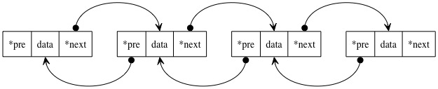

## 双向链表
单向链表中在每个节点维护一个后继节点的引用，可以在O(1)时间复杂度内访问节点的后继节点，但是访问前驱节点需要从头节点
遍历，才能找到前驱节点。因此，双向链表指的是，在当前节点维护一个前驱节点的引用，使得当前节点能在O(1)时间复杂度内访问
前驱节点和后继节点。
如图所示：  

## 头哨兵和尾哨兵
同样头节点和尾结点比较特殊，头节点的前驱节点指针指向nil，尾结点的后继节点指针指向nil。

在实现单向链表的时候，我们已经发现：在插入或者删除尾节点时，需要额外的操作将新旧尾结点的后继节点引用更新。体现在代码
中就是会多出一个是否是尾节点的条件判断。那么实现双向链表就要处理头和尾两种特殊情况，更新头结点的前驱节点指针指向nil和
尾结点的后继节点指针指向nil。

我们可以在链表的头部和尾部分别追加一个节点：链表的起始位置之前增加一个头节点称为头哨兵，
结束位置之后增加一个节点称为尾哨兵。哨兵节点不存储任何主序列的数据，仅仅作为链表的边界，如此一来真正链表的节点都处于
两个节点之间，避免了特殊节点的操作，是的所有节点的添加和删除都能统一完成。

实现代码就不写了，可以参考单向链表，维护一个指向前驱节点的应用即可。

# NEXT
[循环链表](../d_循环链表)

