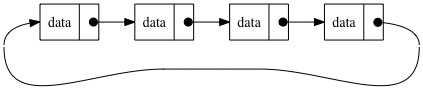
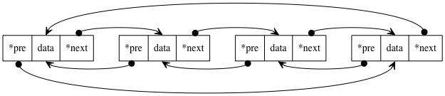

## 循环链表
循环链表相对于链表来说没有特定的开始和结束的概念，头尾相连，是一种更为通用的数据模型。

## 单向循环链表

单向链表的尾结点指向头节点，即是单向循环链表。

单向循环链表的节点形成了一个闭环，在处理轮转调度的问题上要由于普通链表。
实现队列：    
用单向链表实现队列，当有元素入队、出队时，要做好头尾节点的维护，更有在元素唯一时，尾结点要转为头节点用于出栈。  
单向循环链表队列，仅仅只需要维护尾节点即可，因为总是可以通过尾结点找到头结点。

如果数据可以形成一个闭环，就可以用循环链表来解决。比如约瑟夫环，用单向链表来解决，十分形象生动（在不考虑性能的情况下）。

## 双向循环列表

双向循环链表，顾名思义，在双向链表的基础上，头结点指向尾节点，尾结点指向头节点。

可以用来实现双端队列。