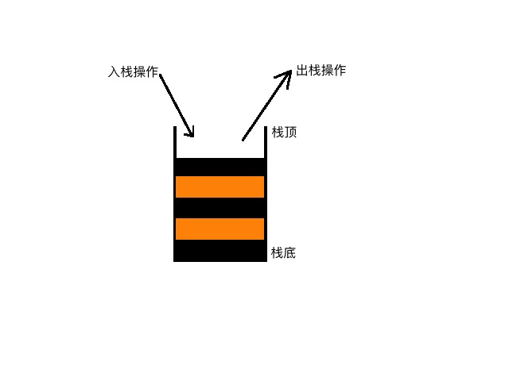

## 栈
栈可以说是最简单的数据结构，但同样也是最重要的数据结构。在很多应用中都能看到它的痕迹，而且在很多更复杂的数据结构中和
算法中充当工具。

## 栈的特性
后进先出（LIFO： Last In First Out），元素入栈放在最上方，元素出栈从最上方取出元素。

## 栈的应用
1.浏览器的回退功能、前端开发中的路由很多也是基于栈开发的。

2.数据的逆序，可以将数据入栈后再出栈即可得到逆序的数据。

3.括号匹配，比如给定一个字符串，请检测字符串中的左右括号是否匹配。

4.栈还在其他的数据结构中得到应用，比如用两个栈来实现一个队列。

## 栈的实现
[栈（数组实现 & 链表实现）](../../code/05/stack/stack.go)

# NEXT
[队列](../b_队列)

