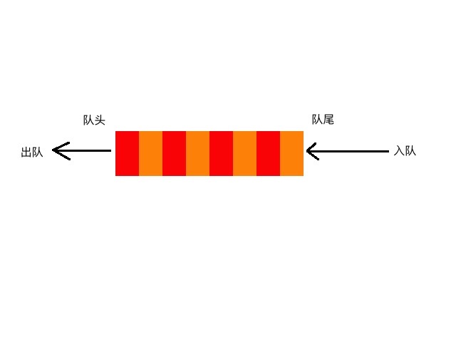

## 队列
队列也是一种基本的数据结构，与栈可以说是一种"表亲"关系，原理就和我们平常排队买奶茶一样。

## 队列的特性
先进先出（FIFO），与栈的特性相反。通常情况下我们将入队的一端叫做队尾，出队的一端叫做队头。

## 队列的实现
链表实现原理一致，这里仅用动态数组slice实现。
[队列（slice实现）](../../code/05/queue/queue.go)

# NEXT
[队列](../c_双端队列)