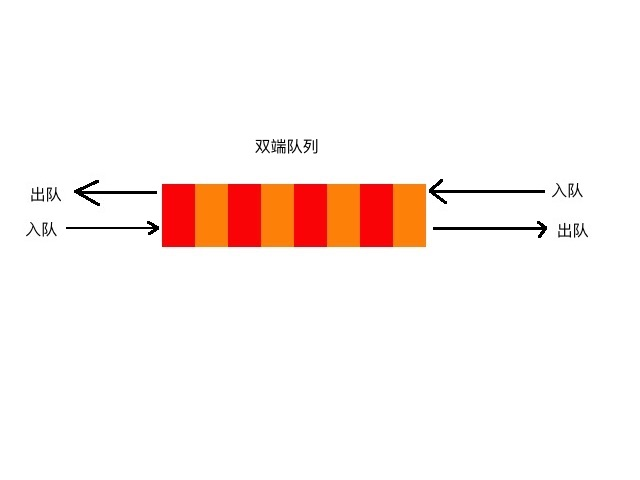

## 双端队列
队列支持队尾添加元素，队头弹出元素，而双端队列支持队尾、队头均可以添加、弹出元素。

## 双端队列应用
在普通队列中，我们无法保证每个节点的值有序，除非在入队之前先进行排序，但这并不是通过队列本身保证的。  
通过双端队列我们就可以实现这一点，保证节点的值有序（DQ：代表双端队列）：

大小降序：
1. DQ为空，直接入队
2. 从队尾入队元素与队尾当前元素比较，如果入队元素较小，直接入队
3. 从队尾入队元素与队尾当前元素比较，如果入队元素较大，则队尾元素出队，直到符合第2步骤条件，入队

如此一来，我们可以保证双端队列内元素有序。如果要存入全量数据，则可以将队尾出队的元素保存后重新入队。

根据这个特性，一般常用来解决在一片连续数据上，确定某个区间内的数据最大值、最小值等等。

## 优先级队列
我们知道，在解决最大值、最小值的问题时，更通用的方法是堆排序，优先级队列即通过堆实现，将放到树结构写完之后详细介绍。

## 双端队列实现
