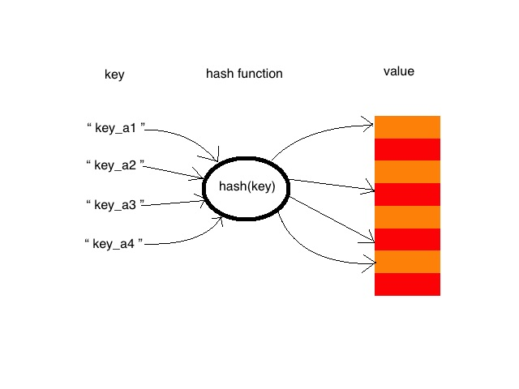

## 哈希表
哈希表又叫散列表，表示的是一种通过键（key）直接访问在内存存储位置的数据结构，在go语言中表现为map数据结构。
在map中，每个唯一的key都被映射到对应的值上。在哈希表中存储、访问数据的时间复杂度都是O(1)，类似于数组，
但是hash表中的数据是无序的。

在哈希表中有两个非常重要的概念：哈希函数（散列函数）、哈希冲突（散列冲突、哈希碰撞）

# NEXT
[哈希函数与哈希冲突](../b_哈希函数与哈希冲突)